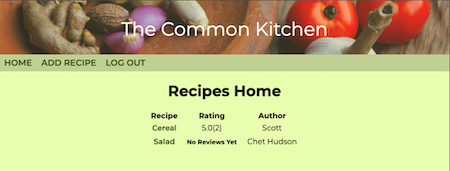
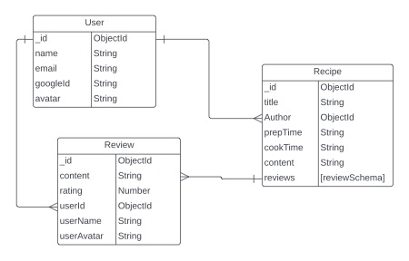

# The Common Kitchen

### A user-contributed cookbook for food lovers.

## Introduction

A simple forum for posting, viewing, and rating recipes from other users. 

## Screenshots

Home page

ERD

## Technologies Used

- **Node/Express** - Used to handle HTTP functionality with Javascript. Node and Express allow JS to handle HTTP requests and allow the implementation of middleware functions.

- **MongoDB/Mongoose** - MongoDB was used to organize data into documents defined with key-value pairs. Mongoose allows the embedding of different data Schema within others, for example the reviews are embedded within the recipe schema. The combination of both creates a flexible database suited for storing data that can vary in its structure case by case.

- **OAuth** - OAuth is an authentication framework used to verify users and restrict access to certain actions to specific users. Only logged-in users are able to add recipes to the database, and users are only allowed to edit or delete content posted by themselves.

## Getting Started

A simple project-planning board was created with [Trello](https://trello.com/b/myL61uju/project-2-planning).

The project is deployed with Heroku. [Click Here](https://sei-cookbook-forum.herokuapp.com/recipes) to check it out!

## Next Steps

I hope to improve the UI and functionality with the following:

- Ability to add additional input fields to organize recipe instructions into an ordered list

- Star icons to display rating in a common format

- Input for ingredients and common measurements

- Ability to add photos of food both in the recipes and reviews